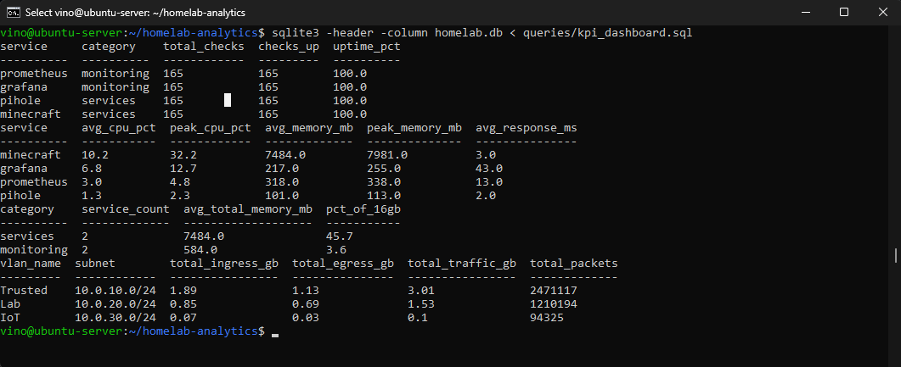
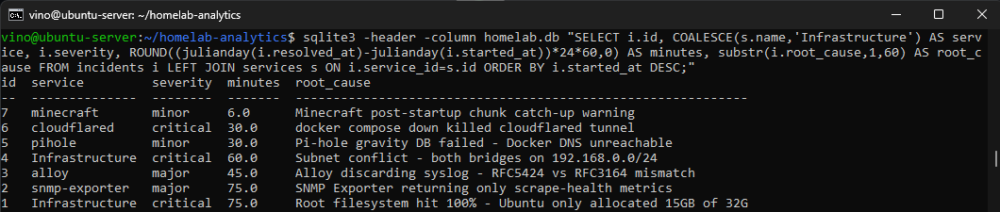
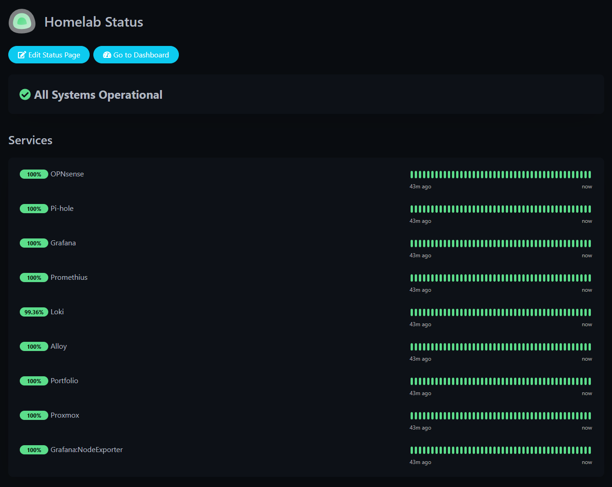
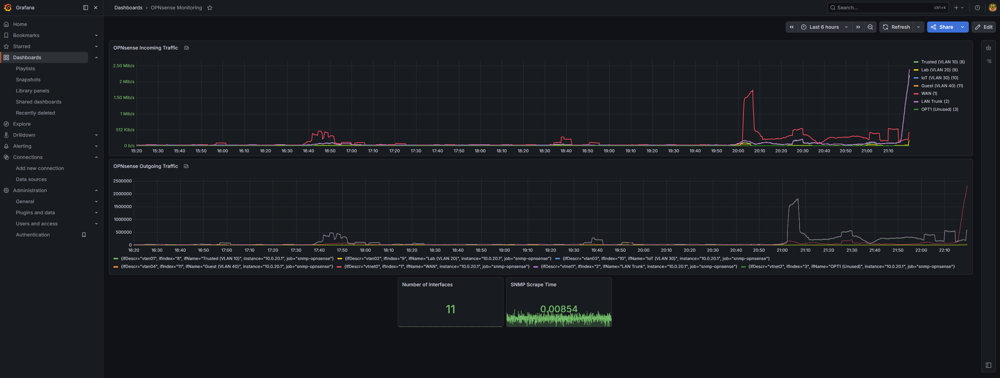
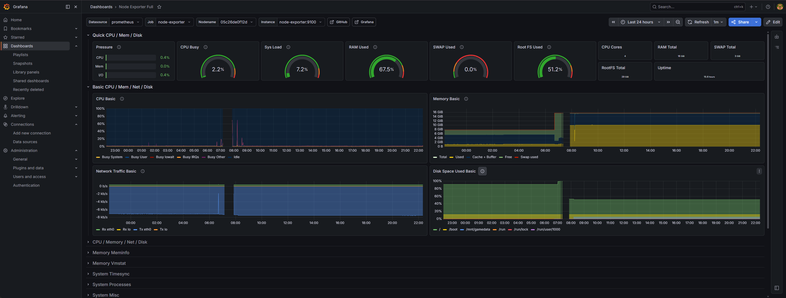
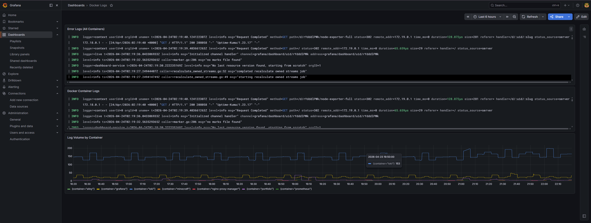

# Homelab Infrastructure Analytics

SQL-based analytics project built on real infrastructure data from a lab environment modeled after production monitoring workflows. Demonstrates database design, SQL querying, KPI tracking, trend analysis, and data-driven reporting.

## Business Problem

This project analyzes homelab infrastructure data to identify service uptime patterns, incident trends, VLAN traffic distribution, resource utilization, and capacity risks. The goal is to transform raw operational metrics into actionable insights — the same workflow used in enterprise BI reporting.

## Key Insights

- Trusted VLAN generates the majority of network traffic (3.01 GB over 7 days), indicating primary workload concentration on personal devices
- All critical services maintain 100% uptime across 168 hourly checks, validating monitoring reliability and infrastructure stability
- Minecraft server consumes 7.4 GB average memory (46% of total VM RAM), flagging it as the primary candidate for capacity planning
- Most critical incidents are infrastructure-related (subnet conflicts, disk exhaustion) rather than application-level, suggesting foundational architecture improvements have the highest ROI
- Average resolution time increases with severity: critical incidents average 55 minutes vs 18 minutes for minor issues, indicating a need for runbook automation on high-severity scenarios
- Configuration changes (syslog format, SNMP config, compose operations) are the most common source of service disruption, supporting a case for change management procedures

## BI Analyst Skills Demonstrated

| Skill | How It's Applied |
|-------|-----------------|
| SQL Querying | JOINs, CTEs, window functions (LAG, PARTITION BY), subqueries, CASE expressions, date functions |
| KPI Reporting | Service uptime %, mean time to resolution, resource utilization, traffic volume |
| Data Validation | Cross-referencing metrics against baselines, threshold-based health checks |
| Trend Analysis | Time-series patterns, week-over-week growth, peak usage identification |
| Dashboard-Ready Reporting | Queries structured to feed BI dashboards (summary tables, aggregations, ranked outputs) |
| Data Storytelling | Translating query outputs into actionable insights for non-technical stakeholders |
| Technical Documentation | Schema diagrams, query descriptions, sample outputs, metric definitions |

## Dashboard & Visualization Examples

### KPI Query Output


SQL queries calculating service uptime percentages, resource utilization by service, memory allocation by category, and per-VLAN traffic volume.

### Incident Analysis


Incident timeline query joining services and incidents tables to calculate downtime duration and summarize root causes by severity.

Key observations:
- Most critical incidents are infrastructure-related (subnet conflicts, disk exhaustion)
- Average resolution time increases with severity level
- Configuration changes are a common source of service disruption

### Service Uptime Monitoring


Real-time service availability tracking with uptime percentages across all monitored endpoints. Validates the 100% uptime KPI shown in SQL query outputs.

### Network Traffic Analysis


VLAN-level ingress and egress trends collected via SNMP from OPNsense, with interface names relabeled from raw IDs to human-readable VLAN names. Used to identify traffic concentration and usage patterns.

### System Performance Metrics


CPU, memory, disk, and network utilization dashboards for capacity planning and resource trend analysis. Data source for the resource usage KPI queries.

### Log Analysis


Centralized log aggregation from all Docker containers via Loki and Grafana Alloy. Log volume by container chart enables anomaly detection and targeted troubleshooting.

## Sample Query Outputs

### Service Uptime (7 Days)

```
| service    | category   | checks | uptime_pct |
|------------|------------|--------|------------|
| prometheus | monitoring | 168    | 100.0      |
| grafana    | monitoring | 168    | 100.0      |
| pihole     | services   | 168    | 100.0      |
| minecraft  | services   | 168    | 100.0      |
```

### Average Resource Usage by Service

```
| service    | avg_cpu | peak_cpu | avg_mem_mb |
|------------|---------|----------|------------|
| minecraft  | 10.2    | 34.8     | 7387       |
| grafana    | 6.3     | 13.0     | 219        |
| prometheus | 3.5     | 5.0      | 310        |
| pihole     | 1.5     | 2.5      | 100        |
```

### Mean Time to Resolution by Severity

```
| severity | incidents | avg_mttr_min |
|----------|-----------|--------------|
| critical | 3         | 55           |
| major    | 2         | 60           |
| minor    | 2         | 18           |
```

### Incident Log (Root Cause Analysis)

```
| id | service        | severity | min | root_cause                                          |
|----|----------------|----------|-----|-----------------------------------------------------|
| 7  | minecraft      | minor    | 6   | Minecraft post-startup chunk catch-up warning       |
| 6  | cloudflared    | critical | 30  | docker compose down killed cloudflared tunnel       |
| 5  | pihole         | minor    | 30  | Pi-hole gravity DB failed - Docker DNS unreachable  |
| 4  | Infrastructure | critical | 60  | Subnet conflict - both bridges on same subnet       |
| 3  | alloy          | major    | 45  | Syslog format mismatch (RFC5424 vs RFC3164)         |
| 2  | snmp-exporter  | major    | 75  | SNMP returning scrape-health only, no interface data|
| 1  | Infrastructure | critical | 75  | Root filesystem hit 100% - only 15GB allocated      |
```

### Disk Capacity Health Check

```
| mount_point   | total_gb | used_gb | free_gb | used_pct | status  |
|---------------|----------|---------|---------|----------|---------|
| /             | 30.0     | 15.4    | 14.6    | 51.3     | HEALTHY |
| /mnt/gamedata | 196.0    | 5.4     | 190.6   | 2.8      | HEALTHY |
```

## Schema

```
services              service_metrics        incidents
  id (PK)               service_id (FK)        id (PK)
  name                  timestamp              service_id (FK)
  category              cpu_percent            started_at
  port                  memory_mb              resolved_at
  vlan                  status                 severity
  host                  response_time_ms       root_cause / resolution

vlans                 network_traffic        disk_metrics
  vlan_id (PK)          vlan_id (FK)           mount_point
  name                  timestamp              disk_type
  subnet                bytes_in/out           total_gb / used_gb
  gateway               packets_in/out         timestamp
  firewall_policy
```

## Files

| File | Description |
|------|-------------|
| `schema.sql` | Database schema — table definitions with constraints and indexes |
| `seed_data.sql` | Sample data based on actual homelab infrastructure |
| `queries/kpi_dashboard.sql` | Core KPI queries — uptime, MTTR, resource utilization, traffic |
| `queries/trend_analysis.sql` | Time-series analysis — weekly trends, peak usage, growth patterns |
| `queries/incident_report.sql` | Incident management — severity breakdown, resolution times, root cause |
| `queries/capacity_planning.sql` | Storage and resource forecasting with window functions |
| `queries/network_analysis.sql` | Per-VLAN traffic analysis, bandwidth utilization, anomaly detection |

## How to Run

Works with SQLite (no server needed), PostgreSQL, or MySQL.

```bash
# SQLite (simplest)
sqlite3 homelab.db < schema.sql
sqlite3 homelab.db < seed_data.sql
sqlite3 -header -column homelab.db < queries/kpi_dashboard.sql
```

## Data Source

Data modeled from a lab environment running:
- **Proxmox VE 9.1.7** with 2 VMs (Ubuntu Server + OPNsense)
- **15 Docker containers** across monitoring, services, and management
- **4 active VLANs** with per-VLAN firewall policies
- **Full observability stack** — Prometheus, Grafana, Loki, Uptime Kuma

Incidents in the dataset are real troubleshooting events from the build process, including disk space crises, SNMP configuration failures, syslog format mismatches, and subnet routing conflicts.

## About

Built by [Gavin White](https://gavinwhite.dev) — CompTIA Security+ certified, studying for CCNA.
